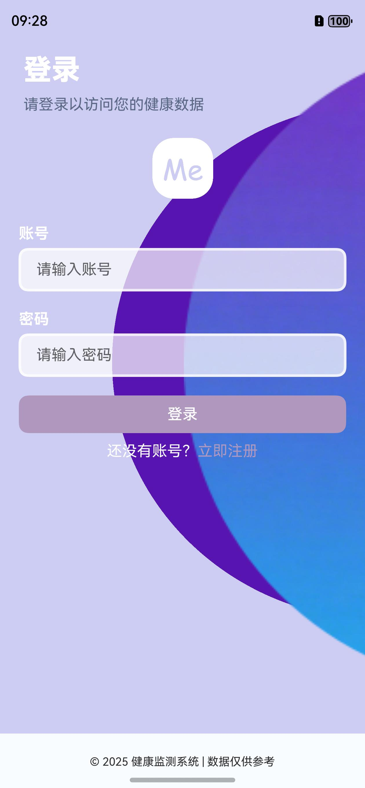
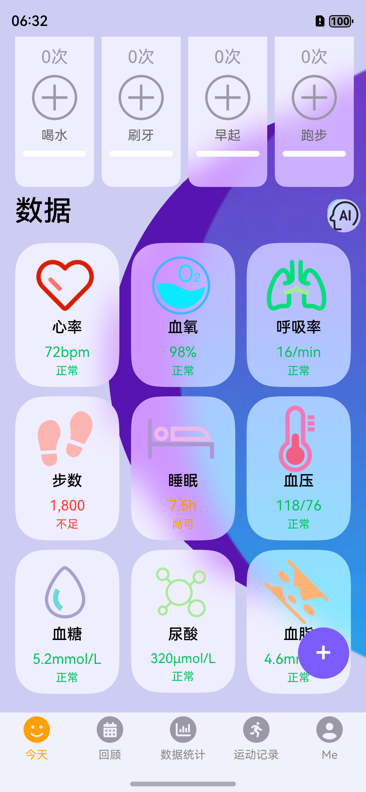
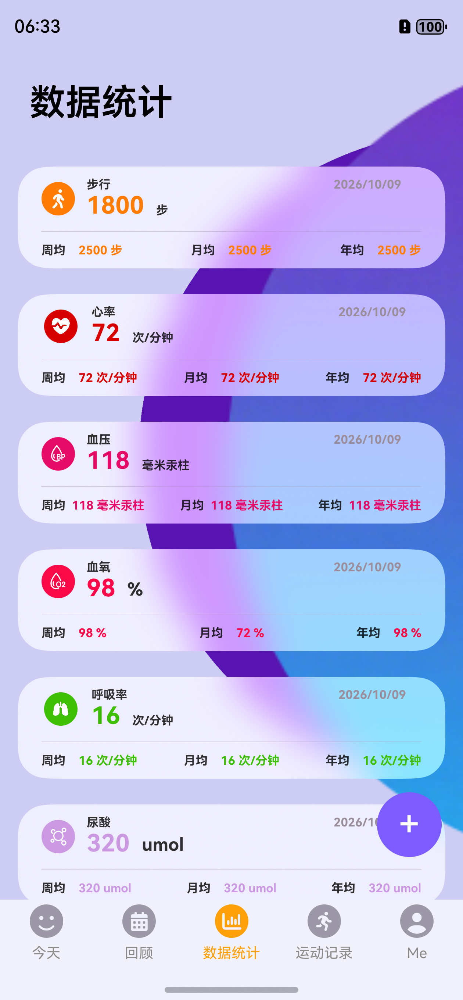
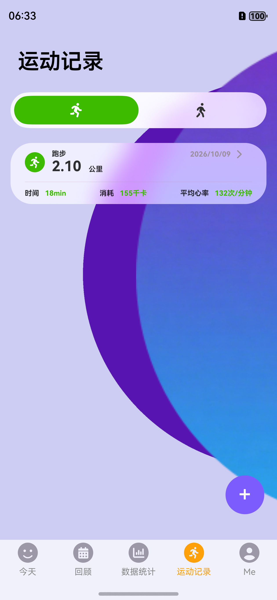
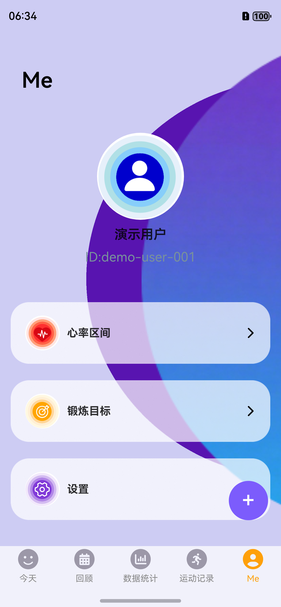
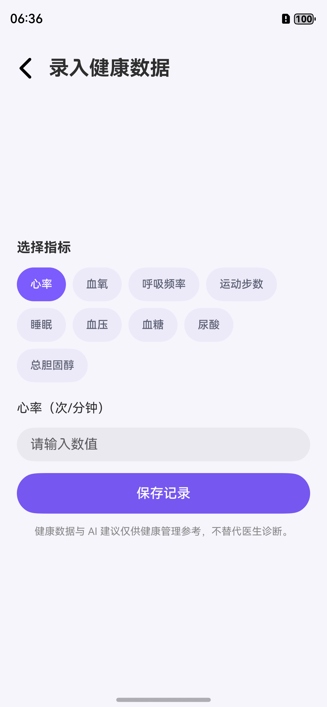
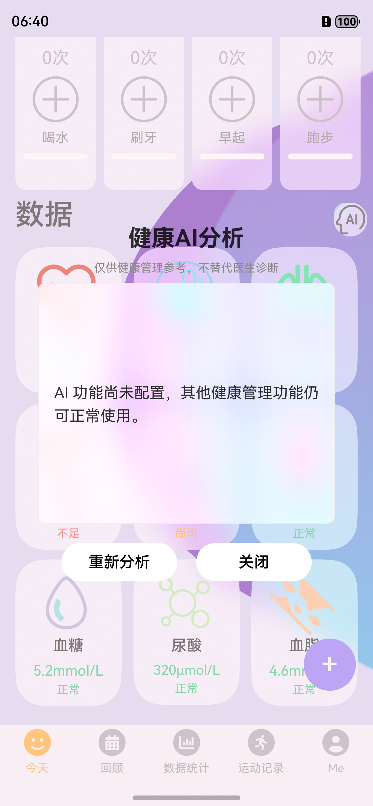
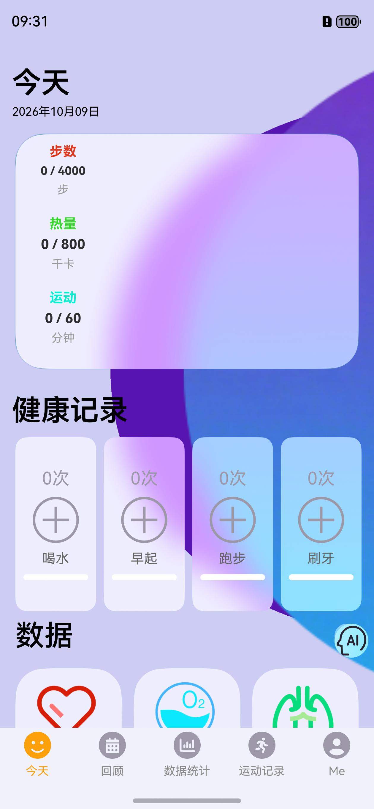

# 健康管理系统

一个面向个人学习与作品展示的健康管理项目，包含 HarmonyOS 客户端、Spring Boot API、MySQL 数据库迁移和可选的 DeepSeek 健康建议。项目支持注册登录、个人资料、健康目标、九类健康数据手动录入、趋势统计、运动记录、习惯打卡与用户数据隔离。

> 健康数据与 AI 内容仅供日常健康管理参考，不替代医生诊断。本项目不是医疗器械或正式医疗产品。

## 界面预览

以下截图来自 HarmonyOS 模拟器，使用脱敏的 `demo` 演示账号和示例数据。

| 登录 | 首页：习惯与健康指标 |
| --- | --- |
|  |  |

| 数据统计 | 运动记录 |
| --- | --- |
|  |  |

| 个人中心与目标入口 | 录入健康数据 |
| --- | --- |
|  |  |

| AI 未配置时的提示 | 历史回顾 |
| --- | --- |
|  |  |

## 功能演示脚本

建议按照“登录 → 首页 → 统计 → 运动 → 录入 → 个人中心 → AI”的顺序演示，约 5～8 分钟即可完整走完主流程：

1. **登录**：输入 `demo / demo123`，说明客户端启动时会检查 Token；无效 Token 会被清理并回到登录页。
2. **首页**：介绍习惯卡片，以及心率、血氧、呼吸率、步数、睡眠、血压等指标的状态提示。
3. **数据统计**：切换底部“数据统计”，展示当前值、周均、月均和年均。
4. **运动记录**：切换“运动记录”，说明运动类型、距离、时长、消耗和平均心率均来自真实记录。
5. **录入闭环**：点击右下角 `+`，选择心率或其他指标，填写数值并保存；回到首页或统计页确认数据刷新。
6. **个人中心**：展示资料、心率区间和锻炼目标入口；修改目标后返回首页查看变化。
7. **AI 降级**：点击 AI 图标。未设置 `AI_API_KEY` 时显示友好提示，其他健康功能仍可正常使用。
8. **退出登录**：退出后 Token 被清理，不能通过返回键回到已登录页面；再次登录即可验证完整闭环。

### 演示前检查清单

- Navicat 中的 `health` 数据库已创建，MySQL 服务已启动。
- IntelliJ IDEA 运行 `DemoApplication` 后，`http://localhost:8080/healthz` 返回 `code: 200`。
- DevEco Studio 已打开 `frontend`，模拟器通过 `http://10.0.2.2:8080` 访问宿主机。
- 如果之前连接过其他数据库，先清理模拟器应用数据或卸载重装，避免旧 Token 引用旧用户。

## 技术栈与结构

- HarmonyOS 5.0.5、ArkTS、Stage 模型
- Java 17、Spring Boot 3.5、MyBatis、JWT、BCrypt
- MySQL 8、Flyway、Docker Compose
- JUnit 5、Mockito、GitHub Actions

```text
health-management-system/
├─ backend/demo/        Spring Boot API、Flyway 迁移和测试
├─ frontend/            HarmonyOS 客户端（entry 模块）
├─ docs/images/         README 演示截图
├─ docker-compose.yml   MySQL 8 开发环境
├─ .env.example         环境变量模板（不含真实密钥）
└─ README.md            启动、演示、接口和故障排查
```

## 快速启动

### 1. 环境要求

- JDK 17
- Docker Desktop（推荐）或 MySQL 8
- DevEco Studio，已安装 HarmonyOS 5.0.5 SDK
- Windows 可直接使用仓库中的 Maven Wrapper；macOS/Linux 使用 `./mvnw`

### 2. 配置环境变量

复制 `.env.example` 为 `.env`，将示例密码和 JWT 密钥替换为你自己的值。`.env` 已被 Git 忽略。

```powershell
Copy-Item .env.example .env
```

生成 JWT 密钥可使用：

```powershell
[Convert]::ToHexString([Security.Cryptography.RandomNumberGenerator]::GetBytes(32))
```

### 3. 启动 MySQL

Docker Compose 会创建 MySQL 8 数据卷；首次启动时由 Flyway 自动建表并导入脱敏演示数据。

```powershell
docker compose --env-file .env up -d mysql
```

演示账号为 `demo`，密码为 `demo123`。这些只是本地学习数据，公开部署前应删除 `V2__add_anonymized_demo_data.sql` 或修改账号。

#### 使用 Navicat 和本机 MySQL

Navicat 是数据库管理客户端，仍需确保本机 MySQL 8 服务已经启动。在 Navicat 中连接 MySQL 后新建查询，创建一个空的专用数据库：

```sql
CREATE DATABASE IF NOT EXISTS health
CHARACTER SET utf8mb4
COLLATE utf8mb4_unicode_ci;
```

不要将 Flyway 直接指向旧项目已经存在数据表的数据库（例如旧的 `test` 库）。旧表缺少新版运动类型、运动时长和平均心率等字段，并且没有 `flyway_schema_history`，会造成启动或查询失败。使用新的空 `health` 库后，后端首次启动会自动完成建表和演示数据初始化，不需要在 Navicat 中手工导入 SQL。

### 4. 启动后端

PowerShell 不会自动读取 `.env`，请先把所需值导入当前终端。下面示例中的值要与 `.env` 一致：

```powershell
$env:DB_URL = 'jdbc:mysql://localhost:3306/health?useSSL=false&allowPublicKeyRetrieval=true&serverTimezone=Asia/Shanghai'
$env:DB_USERNAME = 'root'
$env:DB_PASSWORD = '<your-database-password>'
$env:JWT_SECRET = '<your-random-secret-at-least-32-characters>'
cd backend/demo
.\mvnw.cmd spring-boot:run
```

验证服务：

```powershell
Invoke-RestMethod http://localhost:8080/healthz
```

使用 IntelliJ IDEA 时，用 IDE 打开 `backend` 目录，并将主类设置为 `com.example.demo.DemoApplication`、模块设置为 `demo`、工作目录设置为 `backend/demo`。随后在运行配置的 **Environment variables** 中添加：

| 变量 | 示例值 |
| --- | --- |
| `DB_URL` | `jdbc:mysql://localhost:3306/health?useSSL=false&allowPublicKeyRetrieval=true&serverTimezone=Asia/Shanghai` |
| `DB_USERNAME` | `root`（或你的本地 MySQL 用户名） |
| `DB_PASSWORD` | 你的本地 MySQL 密码 |
| `JWT_SECRET` | 至少 32 字符的随机密钥 |
| `SPRING_FLYWAY_ENABLED` | `true` |

终端中通过 `set` 或 `$env:` 设置的变量不一定会被已经打开的 IntelliJ 继承，因此从 IDE 运行时需要单独填写。运行配置通常保存在 `.idea` 中，该目录已被 Git 忽略；不要把真实密码或密钥提交到仓库。

AI 是可选功能。未设置 `AI_API_KEY` 时后端仍正常启动，只有 AI 接口返回 `503`。启用 DeepSeek 时设置：

```powershell
$env:AI_API_KEY = '<your-api-key>'
$env:AI_BASE_URL = 'https://api.deepseek.com'
$env:AI_MODEL = 'deepseek-chat'
```

### 5. 构建与运行 HarmonyOS 客户端

1. 用 DevEco Studio 打开 `frontend`。
2. 执行 `ohpm install` 安装依赖。
3. 模拟器默认通过 `http://10.0.2.2:8080` 访问宿主机；真机调试请修改 `frontend/entry/src/main/ets/common/ApiConfig.ets` 为电脑的局域网地址。
4. 在 DevEco Studio 中选择本地自动签名后运行。仓库不包含任何签名证书或私钥。

命令行构建（Windows，路径按本机 DevEco 安装位置调整）：

```powershell
$env:DEVECO_SDK_HOME = 'D:\DevEco Studio\sdk'
cd frontend
& 'D:\DevEco Studio\tools\ohpm\bin\ohpm.bat' install
& 'D:\DevEco Studio\tools\hvigor\bin\hvigorw.bat' clean --mode module -p module=entry@default -p product=default assembleHap --no-daemon --no-incremental
```

未配置签名时可完成编译和 HAP 打包，但 DevEco 会提示跳过签名；安装到设备前请启用本地自动签名。

## 数据库与演示数据说明

项目默认使用数据库名 `health`。启动后 Flyway 会按版本执行迁移，创建用户、资料、目标、习惯、健康记录和运动记录相关表，并导入脱敏的 `demo` 示例账号。Navicat 中看到的 `test` 库属于旧项目结构，不是本项目的推荐运行库。

如果后端已经换过数据库但客户端仍显示“服务暂时不可用”，通常是模拟器保存了旧数据库签发的 Token。停止应用后清理应用数据或卸载重装，再使用当前 `health` 库中的账号登录即可；这不会删除 Navicat 中的数据库数据。

## 测试

```powershell
cd backend/demo
.\mvnw.cmd test
.\mvnw.cmd clean package
```

后端普通测试使用 Mockito，不请求真实 AI。真实 AI 验证应只在显式提供 `AI_API_KEY` 的本地环境中执行。前端纯函数测试位于 `frontend/entry/src/test`，全量 ArkTS/HAP 构建命令见上节。

## API 概览

除注册、登录和健康检查外，请求统一携带：

```http
Authorization: Bearer <token>
Content-Type: application/json
```

| 方法与路径 | 功能 |
| --- | --- |
| `GET /healthz` | 服务健康检查 |
| `POST /user/v1/register` | 注册并初始化资料、习惯和 4000 步/800 千卡/60 分钟目标 |
| `POST /user/v1/login` | 登录并获取 7 天有效 JWT |
| `GET /user/v1/info` | 获取不含密码的用户信息 |
| `POST /user/v1/edit` | 更新用户资料 |
| `GET/POST /habit/today`、`/habit/checkin` | 习惯查询与打卡 |
| `POST /health/records` | 新增健康记录 |
| `GET /health/records?type=STEPS` | 查询当前用户记录，`type` 可省略 |
| `DELETE /health/records/{id}` | 删除自己的记录 |
| `GET /health/ai/status` | 查看 AI 是否启用 |
| `GET /health/ai/analysis` | 可选 AI 健康建议 |

健康类型：`HEART_RATE`、`BLOOD_OXYGEN`、`RESPIRATION`、`STEPS`、`SLEEP`、`BLOOD_PRESSURE`、`BLOOD_GLUCOSE`、`URIC_ACID`、`BLOOD_LIPID`。

接口统一返回 `{"msg":"...","code":200,"data":...}`，并使用 HTTP `400/401/404/409/500/503` 区分参数、身份、资源、冲突、系统和可选服务错误。

### PowerShell 快速验证一条数据链路

```powershell
$body = @{ username = 'demo'; password = 'demo123' } | ConvertTo-Json
$login = Invoke-RestMethod -Method Post -Uri http://localhost:8080/user/v1/login -ContentType 'application/json' -Body $body
$headers = @{ Authorization = "Bearer $($login.data.token)" }
$record = @{ type = 'HEART_RATE'; recordedAt = '2026-10-10T10:00:00'; value = 72 } | ConvertTo-Json
Invoke-RestMethod -Method Post -Uri http://localhost:8080/health/records -Headers $headers -ContentType 'application/json' -Body $record
Invoke-RestMethod -Uri 'http://localhost:8080/health/records?type=HEART_RATE' -Headers $headers
```

健康录入页会根据指标切换字段；步数记录还可以填写运动类型、时长、距离、卡路里和平均心率。所有查询和删除接口都按当前 Token 的用户 ID 做隔离。

## 常见问题

- **客户端显示“服务暂时不可用”**：先确认后端 `healthz` 返回 200，再检查模拟器地址是否为 `10.0.2.2`。如果曾切换过数据库，清理模拟器应用数据或卸载重装，避免旧 Token 指向旧用户。
- **客户端连不上后端**：模拟器使用 `10.0.2.2`；真机和电脑需在同一网络，并放行 8080 端口。
- **后端启动提示缺少配置**：必须设置 `DB_PASSWORD` 和不少于 32 字符的 `JWT_SECRET`；从 IntelliJ 启动时要在运行配置中填写。
- **AI 返回 503**：这是未配置 AI 时的预期行为，不影响其他功能。
- **Flyway 提示非空库**：请使用新的 `health` 数据库或新的 Docker volume，不要把迁移直接套到旧的手工表结构。
- **HAP 无法安装**：构建产物默认未签名，请在 DevEco Studio 中配置本地自动签名。
- **DevEco Studio 提示内存不足**：关闭不需要的工程和模拟器，增加 IDE/模拟器内存后重新同步；这通常不是业务代码错误。

## 安全说明

- 仓库不包含真实数据库密码、JWT 密钥、AI 密钥或签名材料。
- 密码使用 BCrypt 保存；客户端不记录密码和 Token；用户响应不返回密码。
- 健康记录查询和删除均按 JWT 中的用户 ID 隔离。
- 如果旧仓库曾提交过密钥，应在对应平台立即轮换；仅删除代码中的字符串不能撤销已泄露凭据。

## License

[MIT](LICENSE)
